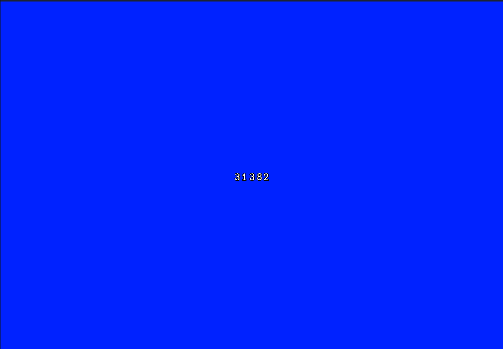

# 4.1 Evaluation of Success Criteria

### Levels and Level Layout

| Ref. No. | Criterion                                                                                        | When was this achieved        |
| -------- | ------------------------------------------------------------------------------------------------ | ----------------------------- |
| 1        | The levels will consist of platforms that are clearly visible and safe for the player to jump on | Usability Testing and Cycle 1 |
| 2        | The level will contain spikes that the player must avoid                                         | Cycle 4                       |
| 3        | The level should be a suitable length.                                                           | Cycle 6                       |
| 4        | The levels are challenging but beatable                                                          | Cycle 6                       |
| 5        | The levels include enemies                                                                       | Cycle 5                       |
| 6        | The level will have a minimalistic style that still looks good.                                  | Usability testing             |

### Criterion 1

<figure><figcaption></figcaption></figure>

The game has very clear platforms that are safe to land on. I used contrasting colours to ensure that the player can easily make out what is an obstacle and where it is safe to land. The platforms   remain the same colour throughout the game, allowing the player to easily recognise them. This was also confirmed in [usability testing](../3-testing/3.2-usability-testing.md#criterion-1).

### Criterion 2

<figure><figcaption></figcaption></figure>

I created two spike sprites and then used a variety of combinations to make a unique set of obstacles for the player to navigate through. The player must avoid these in order to progress through the game.

### Criterion 3

<figure><figcaption></figcaption></figure>

The game lasts for  31382 milliseconds as found in [Cycle 8 - Percentage Score.](../design-and-development/cycle-8-percentage-score.md) I believe that this is a sufficient length and it makes it challenging while remaining enjoyable for the user.&#x20;

### Criterion 4

I included this question in a survey that I sent out in [usability testing.](../3-testing/3.2-usability-testing.md) The large majority of respondents agreed that the game had met this criterion.

### Criterion 5

<figure><figcaption></figcaption></figure>

The game includes enemies that move towards the player at a constant speed. I found that this was the best way to include them in the game, and they add another challenge that the player has to deal with.

### Criterion 6

I kept the colours vibrant and distinct and the shapes were primarily kept simple except for the enemies which are slightly more detailed. Despite the simplicity of the art style, most people thought the game looked good when I sent out a survey in[ usability testing.](../3-testing/3.2-usability-testing.md)&#x20;

### Non-functional

| Ref. No. | Criterion                                   | When was this achieved                                     |
| -------- | ------------------------------------------- | ---------------------------------------------------------- |
| 7        | The game runs smoothly and without crashing | Testing for function and robustness and usability testing. |
| 8        | The game contains no inappropriate content  | Usability testing                                          |
| 9        | The frame rate must be at least 30 fps      | Function and Robustness testing                            |

### Criterion 7

This was met in [Testing for Function and Robustness](../3-testing/3.1-robustness.md), and in [usability testing](../3-testing/3.2-usability-testing.md). After putting the game under lots of stress it never crashed for me, and none of the respondents reported the game crashing.

### Criterion 8

This was met in [usability testing](../3-testing/3.2-usability-testing.md), and all respondents agreed that the game contained no inappropriate content.

### Criterion 9

This was met in [Testing for Function and Robustness](../3-testing/3.1-robustness.md) where I used the developer tools to check the frame rate of my game. It remained over 30 FPS for the entirety of the time I played for.

### User Interface

| Ref. No. | Criterion                                                                 | When was this achieved        |
| -------- | ------------------------------------------------------------------------- | ----------------------------- |
| 10       | There should be a main menu that is easy and efficient to use             | Cycle 2 and usability testing |
| 11       | There should be an option to pause and exit to menu mid game.             | Not met                       |
| 12       | There should be a health bar in game that is clear for the player to see. | Not met                       |
| 13       | The player should get a percentage score at the end of the game.          | Cycle 8                       |

### Criterion 10

<figure><figcaption></figcaption></figure>

I designed the main menu in cycle 2 and I tried to make it simple and easy to navigate through. In [usability testing](../3-testing/3.2-usability-testing.md) the majority of respondents agreed that the menus were easy to navigate.

### Criterion 11

I initially wanted to include this feature as I thought that it would make it a better experience for the user and allow them to pause mid-way through the game if they had to stop for some reason. However due to the fast-paced nature of the game I thought that this feature became less relevant and I didn't make it a priority. I ended up not creating this feature and instead prioritised the more important success criteria that I had set.

### Criterion 12

This criterion was not met due to the fact that I decided not to introduce the enemies in the way I had initially set out to do. Instead of creating enemies that damaged you slightly I made them instantly kill the player when there was contact. Because of this the health bar became completely irrelevant so I didn't end up creating it.

### Criterion 13

<figure><figcaption></figcaption></figure>

This criterion was met and above you can see the players score being shown on the death screen. I think this feature really adds to the experience and makes the player want to keep playing in order to improve their score. Lots of people who tested the game also liked to compare their high scores after they had played, which added a competitive element to the game.

### Mechanics

| Ref. No. | Criterion                         | When was this achieved |
| -------- | --------------------------------- | ---------------------- |
| 14       | Collision Detection               |                        |
| 15       | Gravity                           |                        |
| 16       | Auto movement at a fixed velocity |                        |
| 17       | Jumping Controls                  |                        |
| 18       | Shooting                          |                        |
| 19       | Power Ups                         |                        |
| 20       | Camera scrolling                  |                        |

